# git勉強会

## 最初に設定しましょう

### git config

名前とメールアドレスを設定してあげます

```bash
git config --global user.name hoge
git config --global user.email example@example.com
```

### 作業ディレクトリ(ワーキングツリー)の作成

これから作業するディレクトリを作成します。

```bash
mkdir pandd_git
cd pandd_git
```

このディレクトリをgitの管理対象にするため、初期化します。

```bash
git init .
```


## 実際にやってみよう

電卓プログラムをgitでバージョン管理しながら作っていきます

### プログラムの概要

```bash
$ ./a.exe
1 + 2
3
1 - 2
-1
```

a 演算子 b の形式で入力すると計算結果が出力されるプログラムを作成していきます

## 1. addとcommit

### ファイルの作成

`main.c`という名前でファイルを作成してください。

```bash
touch main.c # touchは空のファイルを作成するコマンドです
```

これで、作業ディレクトリ(ワーキングツリー)に新しいファイルが作られました。

### git status

`git status`コマンドはリポジトリの状態を確認できます。

コミットツリーに記録されていない変更があれば、表示してくれます。

```bash
git status
```

main.cファイルが作成されたことはコミットツリーに記録されていないので、**赤色**で表示されます。


### git add 

`main.c`ファイルを作成したことをリポジトリにセーブしましょう。

まずは、インデックスに追加していきます。

`git add ファイル名`コマンドは引数に渡したファイルをインデックスに追加します。

```bash
git add main.c
```

statusを確認してみると、インデックスに追加されたため**緑色**で表示されます


### git commit

インデックスに追加できたので今度はコミットツリーに記録します。

記録する履歴のことを**コミット**といいます。

また、何の変更をしたのか後で分かるようにコメントを残す必要があります。このコメントを**コミットメッセージ**といいます。

`git commit -m "コミットメッセージ"`コマンドはインデックスに登録された変更をコミットツリーに記録します。また、mオプションをつけることでコミットメッセージを書くことができます。

```bash
git commit -m "main.cファイルを作成"
```

statusを確認してみると、コミットツリーに記録されていない変更はないと表示されます。


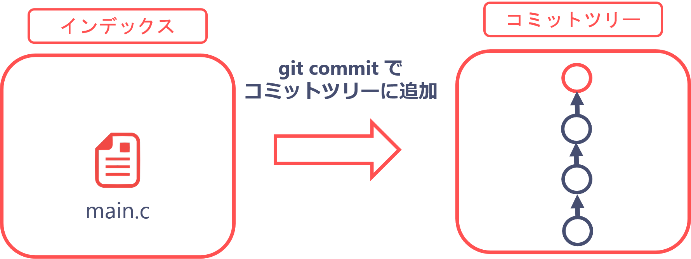

### git log

`git log`コマンドは過去のコミット一覧を確認することができます。

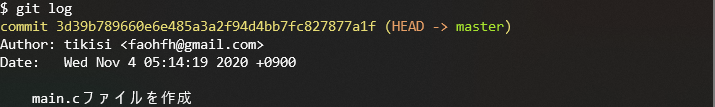

3d39b.....という文字列はこのコミットの識別番号で後で現在の状態を復元したいときに使います。

## 2. main.cに変更を加える

### 編集

main.cは現在空のファイルなので中身を書いていきます。

とりあえず、読み込み部分だけ記入しましょう。

```c
#include <stdio.h>

int main() {
    int a, b;
    char c;
    
    scanf("%d %c %d", &a, &c, &b);
    
    return 0;
}
```

コミットツリーに記録されていない変更ができたため、`git status`で確認すると赤く表示されます。

### git diff

最新のコミットと現在のワーキングツリーを比較してどんな変更が加わったのか確認することができます

```bash
git diff
```

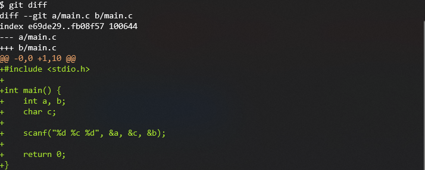

追加された行は+で表示されます。対して、削除された行があった場合は-で表示されます。

### 記録

今回の変更をコミットツリーに記録しましょう

```bash
git add main.c
git commit -m "読み込み部分を実装"
```

`git log`で確認するとコミットが増えています。

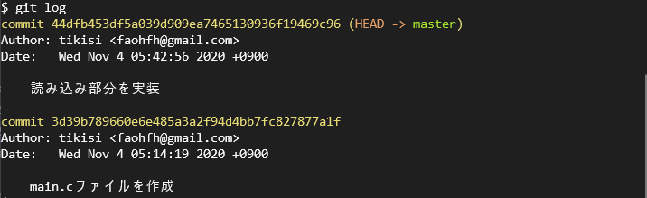

### インデックスは何のためにあるの？

> A. コミットしたい変更を選んでからコミットできるからです。
> 
>変更を一度にコミットする必要はありません。多くの変更をしたときは分割してコミットすることができます。
> 
>例えば、A,B,Cという3つのファイルで変更があったとします。ですが、AでのコミットメッセージとB,Cでのコミットメッセージを別のものにしたいです。その場合まずAをadd&commit、それからB,Cをadd&commitできます。
> 
>また、addされた変更はdiffコマンドに映らなくなるのでcommitするときの漏れを防ぐことができます。
> 

## 3. ブランチ

ブランチとは並列して作業ができるように、ワーキングツリーとコミットツリーをコピーして別の作業空間を用意する機能です。

### git branch ～ブランチのリスト～

`git branch`コマンドで存在するブランチのリストが確認できます。

```bash
git branch
```

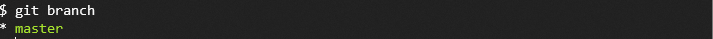

現在いるブランチの先頭に*マークが表示されます。

### git branch ～ブランチの作成～

`git branch ブランチ名`でブランチ名を指定すると新しいブランチを作成することができます。

今回はmain.cに足し算の機能を追加したいので**feature-plus**という名前のブランチを作成します。

```bash
git branch feature-plus
```

`git branch`コマンドで確認するとfeature-plusブランチが追加されています。


### git checkout 

`git checkout ブランチ名`で今いるブランチの切り替えができます。

```bash
git checkout feature-plus
```

### 編集

足し算の機能を追加します

```c
#include <stdio.h>

int main() {
    int a, b;
    char c;
    
    scanf("%d %c %d", &a, &c, &b);
    
    if(c == '+') {
        printf("%d\n", a + b);
    }
    
    return 0;
}
```

### 記録

変更したのでコミットします。

```bash
git add main.c
git commit -m "足し算を実装"
```


ここでfeature-plusブランチでの`git log` で確認してみましょう


masterブランチにcheckoutしてlog再び確認してみます

```bash
git checkout master
git log
```


足し算の実装はfeature-plusブランチで実装したためmasterブランチでそのコミットは表示されないはずです。

また、エディタでmain.cを開いても足し算の実装はされていないはずです。


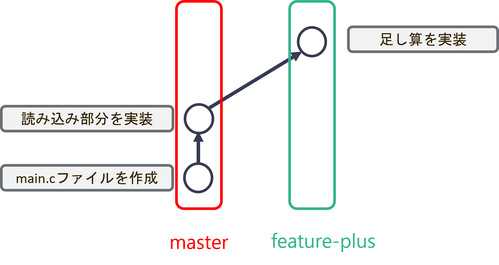

### git merge

feature-plusブランチでの変更をmasterブランチに結合させます。

他のブランチでの変更を結合することをマージするといいます。

`git merge --no-ff ブランチ名`コマンドは引数で指定したブランチをマージすることができます。

```bash
git branch # masterブランチにいることをかくにんしてください
git merge --no-ff feature-plus
```

エディタでmain.cを開くと足し算の実装が追加されています。


### git log --graph

`--graph`オプションをつけることでブランチの分岐・統合の変遷を見ることができます。

```bash
git log --graph
```

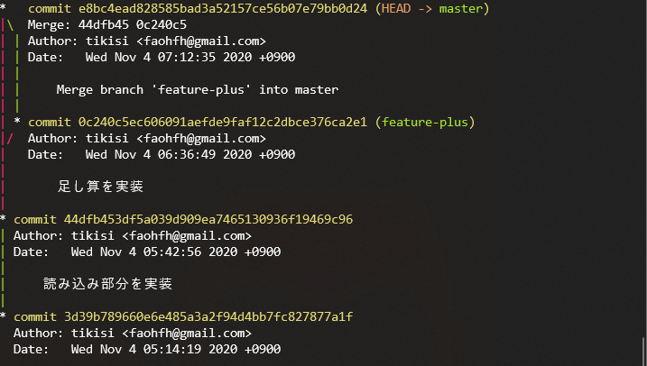

## 4. 過去の状態に戻す

さて、ここでmasterブランチをfeature-Aブランチを切る前の状態まで戻してみましょう

コミットとしてセーブしてあるので戻すことができます。

### git reset 

過去のコミットの状態まで戻りましょう

`git reset --hard ハッシュ値`コマンドでそのコミットの状態まで戻ることができます。

ハッシュ値というのはgit log コマンドで確認することができます。

```bash
git reset --hard 44dfb453df5a039d909ea7465130936f19469c96
```


エディタで中身を開くとソースコードの状態が戻っていると思います。

### 引き算機能を実装するブランチを作成

現在足し算機能のみ実装されているので、引き算の機能を実装していきましょう。

引き算を実装するブランチを作成します。

```bash
git branch feature-minus
```

### git reflog

masterブランチはresetコマンドを使って状態を戻してしまったので状態を戻す前

つまりfeature-plusブランチをマージした時点まで進めましょう。

さっそく、git logでコミットを確認してみます。


あれ？　↓のハッシュ値が欲しいのに見つからない...

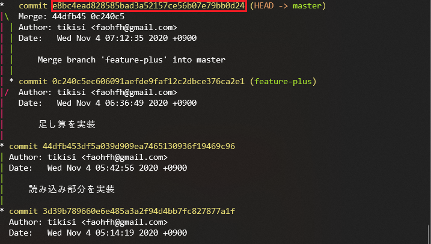

git resetコマンドはコミットの履歴も戻してしまいます。

ここで登場するのが`git reflog`コマンドです。

このコマンドは操作の履歴を確認することができます。

```bash
git reflog
```


feature-plusブランチをマージした地点まで戻します。

```bash
git reset --hard e8bc4ea
```

### 整理

戻したり進んだりしたので、いったん現状のブランチの状態を確認しましょう。


## 5. コンフリクト

先ほどのマージでは特に問題なくマージできました。

しかし素直に結合ができない場合もあります。

### 引き算機能を実装

```bash
git checkout feature-minus # minusブランチに移動
```

引き算の機能を追加します。

```c
#include <stdio.h>

int main() {
    int a, b;
    char c;

    scanf("%d %c %d", &a, &c, &b);

    if(c == '-') {
        printf("%d\n", a - b);
    }

    return 0;
}
```

add, commitします。

```bash
git add main.c
git commit -m "引き算を実装"
```

### masterにマージ

masterブランチにfeature-minusブランチでの変更を適用していきます。

```bash
git checkout master
git merge --no-ff feature-minus
```

コンソールにCONFLICTという文字が表示されます。

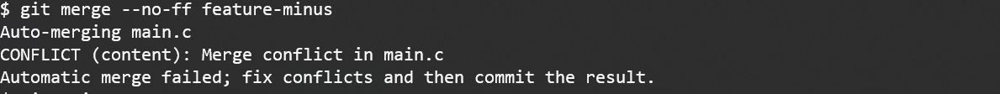

これはマージが上手くいかなかったということです。

マージが上手くいかないことを**コンフリクト**といいます。

### コンフリクト

今回のマージがどういう状況だったのかを考えていきましょう。

まず、下図のようにコミットツリーにA,B,Cという名前をつけます。

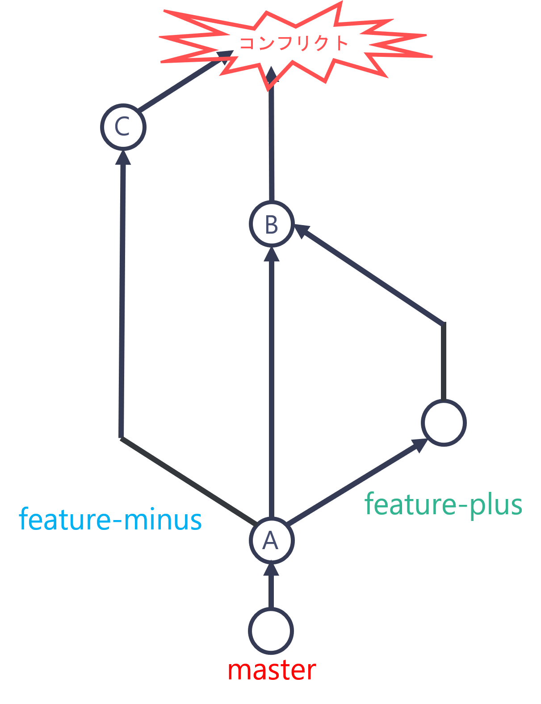

B, Cの親であるAは


B,Cを比較すると

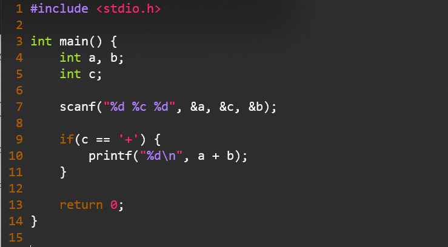    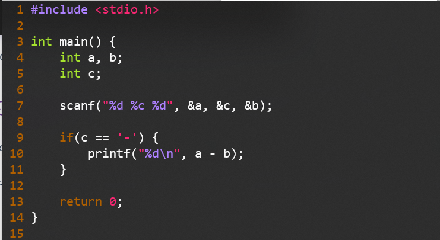

同じ行を編集しています。(9～11行)

マージする際に同じ個所を変更が変更されているとgitはどちらを採用すればよいか判断がつきません。

なのでコンフリクトを発生させてプログラマ自身に判断を任せます。

### コンフリクト解消

main.cファイルを開いてみましょう。

ソースコードのどの箇所が原因でコンフリクトが起きたのか書いてあります。

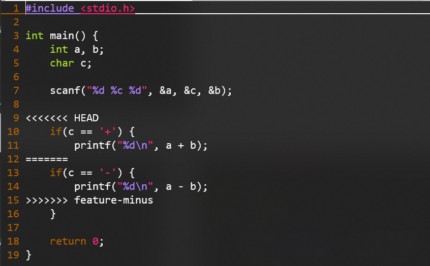

HEADは現在いるブランチの最新のコミットを表しています。

なので<<<<<HEAD　～　=======はBの状態が書かれています。

対して、========　～　>>>>> feature-minusはCの状態が書かれています。


このファイルを意図するように編集してあげましょう。


コンフリクトを直した後はadd, commitが必要です。

```bash
git add main.c
git commit -m "コンフリクト解消"
```

logコマンドで確認すると


## 6. GitHub

### アカウント作成

省略


ここから先は二人一組で作業してもらいます。

これ以降、それぞれのメンバーをAさん、Bさんと呼びます。

### リモートリポジトリの作成

Aさんはリモートリポジトリを作成していきます。

今回はpandd_gitという名前でリポジトリを作成しましょう。

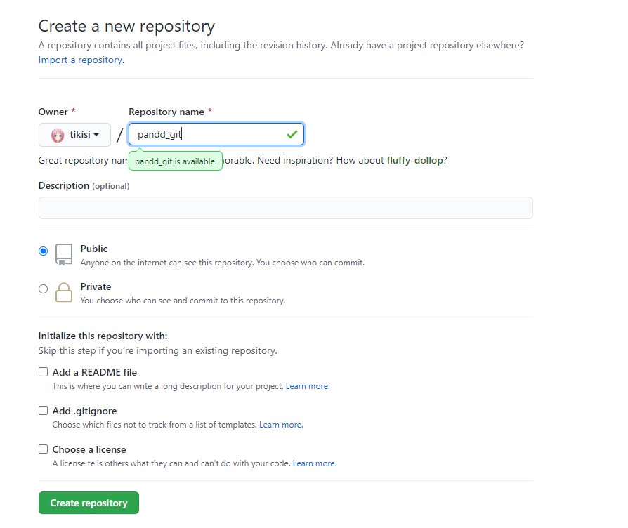

次にHTTPSを選択して、横のURLをコピーします。


以下のコマンドをコンソールから入力してください。

```bash
git remote add origin コピーしたURL
git push -u origin master
```

`git remote add origin`コマンドでリポートリポジトリを登録します。

`git push -u origin master`コマンドでリモートリポジトリのmasterブランチにローカルリポジトリのmasterブランチの内容を送ります。

github上からソースコードが確認できるようになっていると思います。

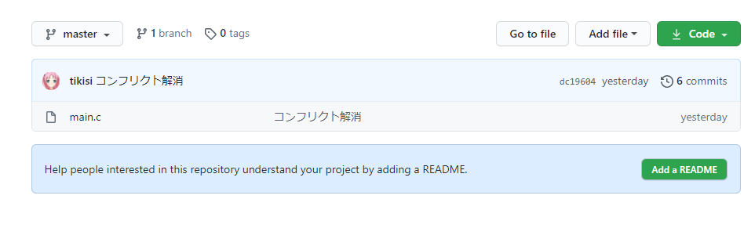

### Collaboratorに追加

Bさんに先ほど作成したリモートリポジトリへの変更権限を付与します。

※誰でも変更ができると荒らされてしまうので、見ることはできますが変更はできないようになっています。

##### Aさん

**Settings>Manage access>Invite a collaborator**からBさんへ招待を送ってあげてください。

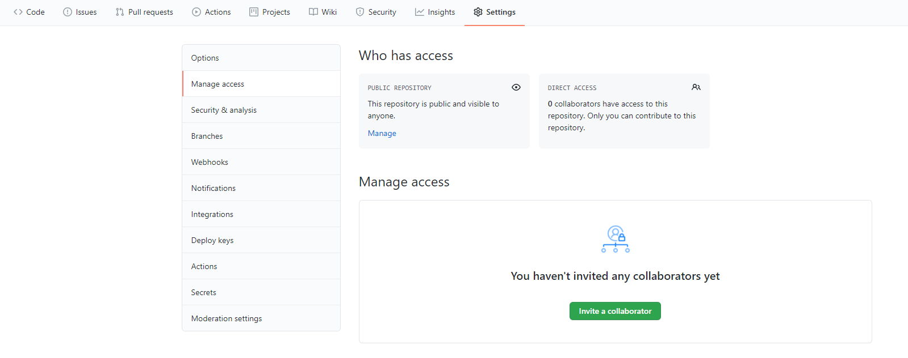

##### Bさん

1. Bさんにはメールが届いていると思うので、招待を承認してください。

2. Aさんの作成したリポジトリにブラウザでアクセスします。

3. Codeボタンを押してHTTPSのURLをコピーしてください。


4. コンソールを開いて、以下のコマンドを入力します。

   ```bash
   git clone コピーしたURL
   cd pandd_git
   ```

   `git clone`コマンドはリモートリポジトリをコピーしてローカルリポジトリを作成します。

## 7. 共同開発

電卓プログラムは足し算と、引き算の機能が実装された状態です。

あと掛け算と割り算の機能も実装していきます。

それぞれの機能をAさんBさんで担当を決めて作ってください。

完成したらadd commitします。

### git push

`git push` コマンドでリモートリポジトリにローカルリポジトリでのコミットを送信します。

```bash
git push origin master
```

### git pull

最初に完成した人は問題なくgit push コマンドが実行できたと思います。

ですが、二人目の人はエラーが出たと思います。これはリモートリポジトリで変更があったためpushできないというエラーです。

なのでリモートリポジトリでの変更を持ってきてあげる必要があります。

`git pull ブランチ名`コマンドでリモートリポジトリの変更をローカルリポジトリに適用できます。

```bash
git pull origin master
```

おそらく同じ個所を変更したためコンフリクトが発生したと思います。

なので、

1. コンフリクトを解消
2. add commit
3. push

してあげましょう。

### git pull 補足

git pullコマンドを実行したらコンフリクトが発生しました。

mergeコマンドを使ったわけでもないのに何故？と思った人もいるかもしれません。

実はgit pull コマンドは2つのコマンドの組み合わせの別名なのです。

```bash
git fetch origin master	# リモートリポジトリからmasterブランチの情報を取得する
git merge origin/master	# リモートブランチのmasterブランチ(origin/master)をローカルリポジトリのmasterブランチにマージ
```


## 8. おまけ～GitHub Flow～

ここから先はおまけなのであまり詳しくはやりません。

### GitHub Flowとは

- チーム開発でGitHubを使用するときの流れをまとめた手順書
- 多くの企業などで採用されている
- 他にもgit flow など色々な流派がある。

### Issue

GitHub上で使用可能なBTS(バグ管理システム)

以下のようなものを管理する

- バグのリスト
- 実装する予定のタスクリスト

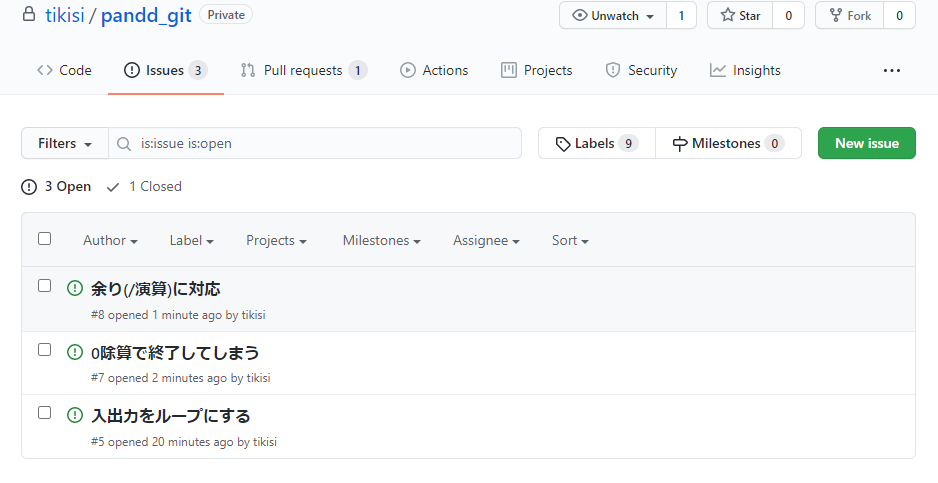

### Pull Request

- トピックブランチでタスクが完了したときにmasterにマージしたり確認してほしいと他のプログラマ依頼する機能
- 他のプログラマはPull Requestを見てコードに問題がないか確認ができる

###### 3つの機能

1. Conversation	チャットで実装について議論できる
2. Commits　　　そのブランチで行われたコミットの一覧が確認できる
3. File Changed    マージ先のブランチとの差分を確認できる

### GitHub Flow の流れ

1. Issueを元にトピックブランチをmasterから切る
2. コードを完成させる
3. リモートのmasterブランチで更新があるかもしれないので、最新のmasterをトピックブランチにマージ
4. git push
5. pull requestを作成
6. 他の開発者にレビューしてもらう(問題が見つかれば2まで戻って修正)
7. masterへマージ


余力のある人は電卓プログラムをGitHubフローを使って改造してみましょう

例.

- 入出力をループして何度も計算できるようにする

- 余りの演算を実装

- 0除算エラーの対策

  etc...

## 9. GitHub Flowの例

ここでは、入出力をループして何度も計算できるようにする実装を例に紹介していきます。

### Issueを作成

New issueから作成画面へ

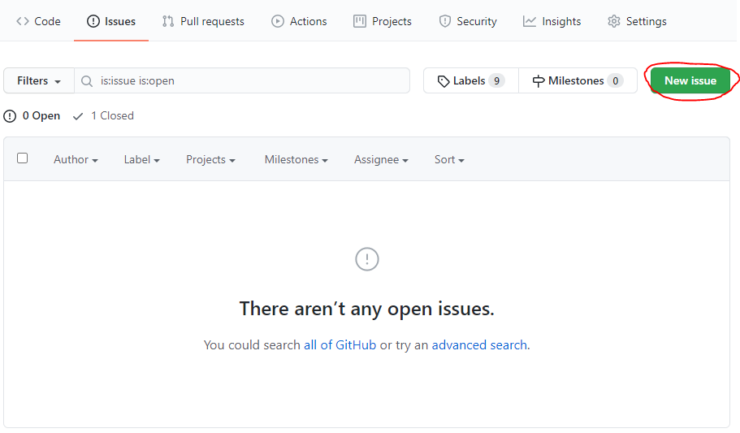

タイトルと詳細を記入して Submit new issueでissue作成

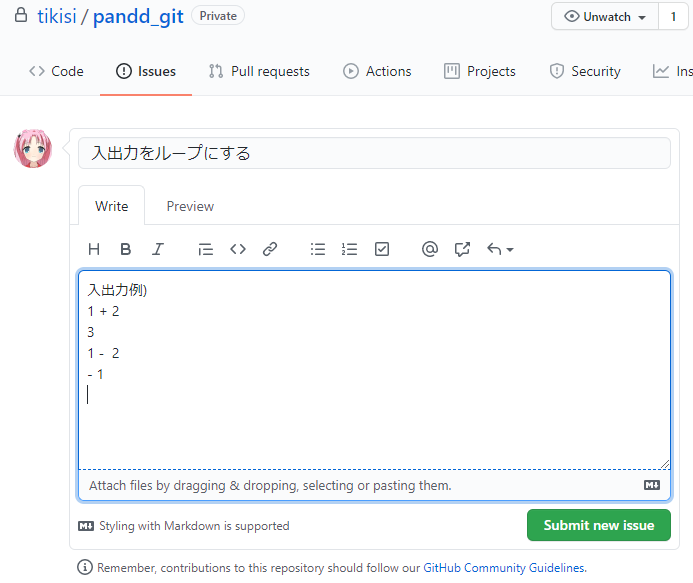

### 実装

ローカルリポジトリでブランチを作成

```bash
git branch feature-loop
git checkout feature-loop
```

main.cを編集

```c
#include <stdio.h>

int main() {
    int a, b;
    char c;

    while(1) {
        scanf("%d %c %d", &a, &c, &b);

        if(c == '+') {
            printf("%d\n", a + b);
        }
        if(c == '-') {
            printf("%d\n", a - b);
        }
        if(c == '*') {
            printf("%d\n", a * b);
        }
        if(c == '/') {
            printf("%d\n", a / b);
        }
    }

    return 0;
}
```

add & commitします。

```bash
git add main.c
git comit -m "入出力をループに"
```

もしかしたらリモートのmasterで変更があるかもしれないのでpullしておきます。

```bash
git pull origin master
```

pushしてリモートの**feature-loop**ブランチに送ります。

リモートにfeature-loopブランチはありませんが、存在しないブランチを指定すると自動で作成されます。

```bash
git push origin feature-loop
```

### Pull Request

GitHub上でPull Requestを作成しましょう。

Compare & pull requestでpull request作成画面へ


pull requestの説明を書くのですが、ここで `Close issue番号`としておきましょう。

こうすることでpull requestがマージされたときにissueが閉じられます。

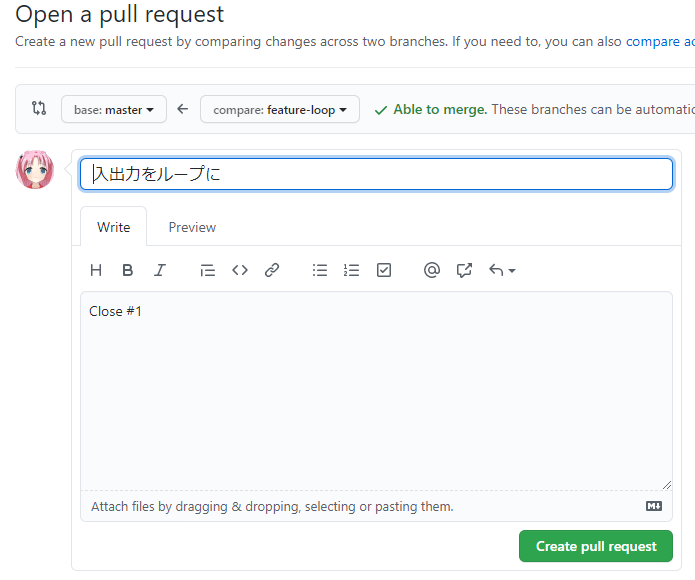


### コードレビュー & マージ

ペアの人はGitHubのPull Requstからコードを確認してあげてください。

問題がある場合はConversationやFileChangedにコメントを書きます。

問題がなければ、Merge pull requestからマージしてください。

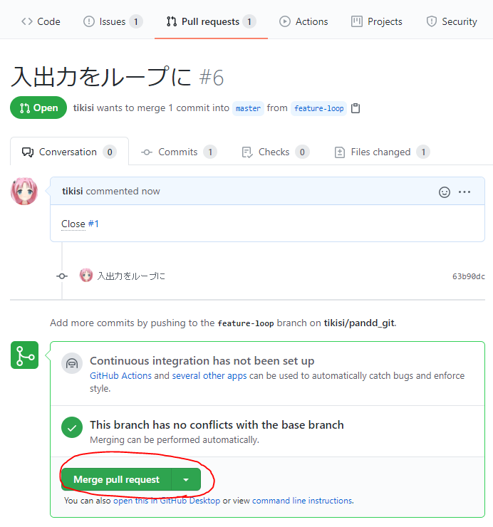


## 10. まとめ

gitを使った開発を大雑把に言うと、

1. プログラムを書く
2. add 
3. commit 

を繰り返し、一つの機能が完成したら

1. git pull でリモートリポジトリの変更をマージ
2. git pushでリモートリポジトリに送る

となります。


なので言ってしまえば

```bash
git add 
git commit 
git push 
git pull
```

以上のコマンドが使えれば何とかなります。（多分


色々な機能をいっぺんに使いこなすのは大変なので、次回のみんげーでは

1. ブランチはmasterのみ
2. commitを残すことで過去の状態に戻せるようにしておく
3. gitのmerge機能を使ってお互いの変更を結合する

といった感じに機能の一部を使うだけでもかなり効率的に開発できると思うので、積極的に使ってみてください。


### 参考資料

gitを勉強するにあたって参考になるサイトを紹介しておきます。

- <a href="https://backlog.com/ja/git-tutorial/intro/01/">サル先生のGit入門</a>

  易しめの入門サイト

- <a href="https://git-scm.com/book/ja/v2">ProGit</a>

  公式の説明書

- <a href="https://www.slideshare.net/kotas/git-15276118?qid=ad0390a6-d824-4103-a3d8-b30a49cccbb1">こわくないgit</a>

  merge --no-ffの意味が分かると思います

